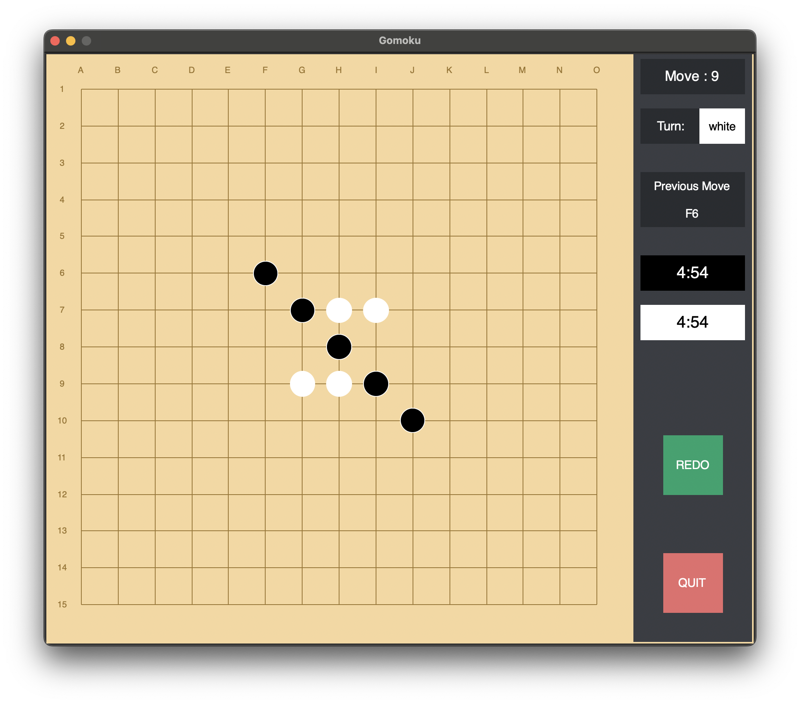
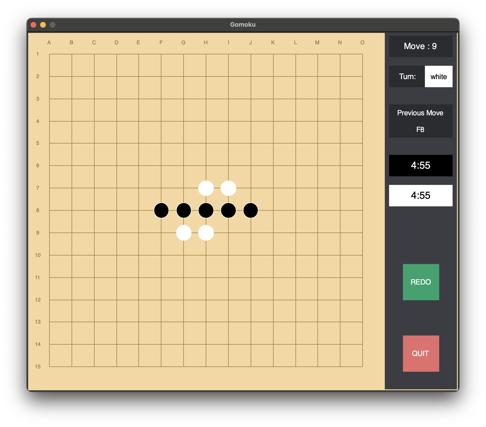

# Gomoku
Made in 2021, a passion project during high school. Gratitude towards Dr.Neat, AP Computer Science Teacher

## What is Gomoku?
Gomoku, called "Five in a Row", is an abstract strategy board game. It is traditionally played with Go pieces (black and white stones) on a Go board. It is played using a 15×15 board, while a 19×19 board was standard in the past. Because pieces are typically not moved or removed from the board, Gomoku may also be played as a paper-and-pencil game. The game is known in several countries under different names.

## How to play? (Run main.py)
Players alternate turns, placing a stone of their color on an empty intersection. There are 5 minutes total given for each player to play their beads throughout the round. Black plays first. The winner is the first player to form an unbroken chain of five stones horizontally, vertically, or diagonally. Placing so that a line of more than five stones of the same color is created does not result in a win.

   

Once the winner is decided, press the ***QUIT*** button to close the application or the ***REDO*** button to play again
## Required package

```sh
pip install Tkinter
```
